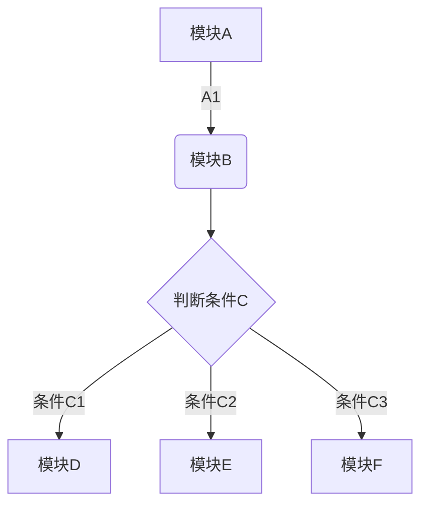
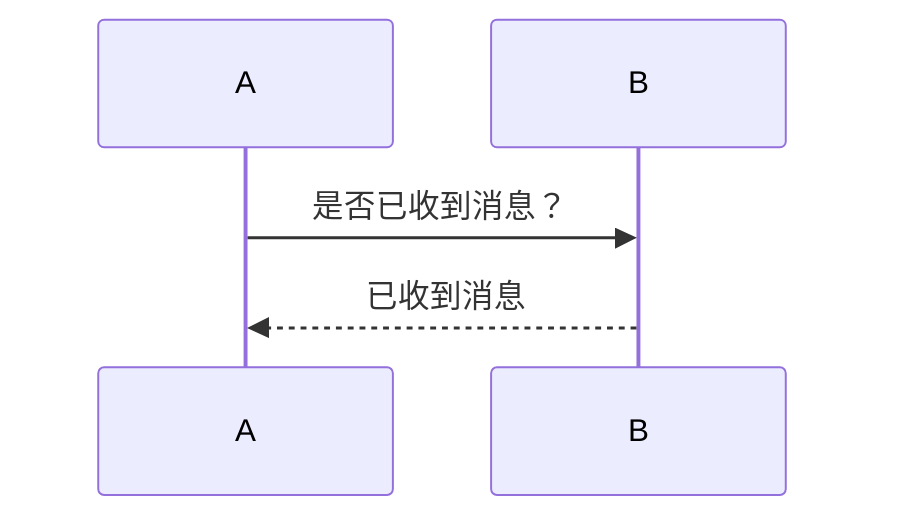
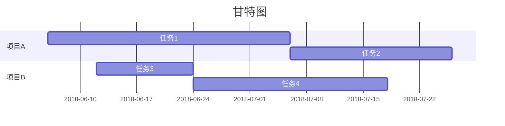

[toc]
##一、Markdown 是什么？
 Markdown 是一种轻量级的「标记语言」，创始人为约翰·格鲁伯，用简洁的语法代替排版，目前被越来越多的知识工作者、写作爱好者、程序员或研究员广泛使用。其常用的标记符号不超过十个，相对于更为复杂的 HTML 标记语言来说，Markdown 十分的轻量，学习成本也不需要太多，且一旦熟悉这种语法规则，会有沉浸式编辑的效果。
 
##二、Markdown 笔记支持哪些语法？ 
 
1. 设置分级标题

 语法示例：
 
```
  # 一级标题
  ## 二级标题  
  ### 三级标题  
  #### 四级标题  
  ##### 五级标题  
  ###### 六级标题  
```  


2. 加粗文本
 语法示例：

```
**印象笔记**
```

 
3. 斜体
 语法示例：

```
*印象笔记* 
```

 
4. 下划线
 语法示例：

```
<u>印象笔记</u> 
```

 
5. 删除线
 语法示例：

```
~~印象笔记不支持Markdown~~ 
```

 
6. 添加分隔线
 语法示例：

```
* * * 
```


   
7. 引用文本
 语法示例：

```
>近日，印象笔记宣布完成重组。作为Evernote已在中国独立运营近6年的品牌，印象笔记将成为由中方控股的中美合资独立运营实体，并获得红杉宽带跨境数字产业基金首轮数亿元人民币投资。 
```


8. 添加符号列表或者数字列表
 语法示例：

```
使用 iOS 版本印象笔记如何快速保存内容？ 
1. 启用印象笔记 Widget ——印象笔记·剪贴板 
2. 复制粘贴任意内容 
     * 微信 
3. 滑动到 Widget 插件区域即可完成保存 
印象笔记·剪贴板有什么特点？ 
* 快：开启自动模式，可以自动保存剪贴板的任意内容 
* 一切：只要可以复制粘贴就可以保存 
* 有序：全部保存在「我的剪贴板」笔记本并以时间来命名 
```


 
9. 添加待办事项
 语法示例：

```
三只青蛙
* [x] 第一只青蛙 
* [ ] 第二只青蛙 
* [ ] 第三只青蛙 
```

 
10. 插入链接
 语法示例：

```
[印象笔记官网](https://www.yinxiang.com/) 
```


   
 
11. 插入图片
 印象笔记支持嵌入网络图片或者直接拖入本地图片，其中本地图片格式支持 jpg、png 和 gif。
 语法示例：

```
 
```


 另外，针对插入的本地图片可以控制图片大小，在拖拽、拷贝或者点击插入本地图片之后，直接在图片名称后面（无需空格）添加以下语法均可以按照以下要求控制图片大小：
*     @w=300   
*     @h=150   
*     @w=200h=100   
*     @h=100w=200   
 
 示例笔记

```
782d277a1dbc7dea8480267cf5f87ebd.png@w=300
```


12. 插入表格
 语法示例：

```
| 帐户类型 | 免费帐户 | 标准帐户 | 高级帐户 | 
| --- | --- | --- | --- | 
| 帐户流量 | 60M | 1GB | 10GB | 
| 设备数目 | 2台 | 无限制 | 无限制 | 
| 当前价格 | 免费 | ￥8.17/月 | ￥12.33/月| 
```


 
13. 插入图表
 目前支持饼状图、折线图、柱状图和条形图，只需将 type 改为对应的pie、line、column 和 bar。

```
```chart 
,预算,收入,花费,债务
June,5000,8000,4000,6000 
July,3000,1000,4000,3000 
Aug,5000,7000,6000,3000 
Sep,7000,2000,3000,1000 
Oct,6000,5000,4000,2000 
Nov,4000,3000,5000, 
   
type: pie 
title: 每月收益
x.title: Amount 
y.title: Month 
y.suffix: $ 
``` 


14. 插入行内代码或代码块
 印象笔记 Markdown 语法支持几十种编程语言的高亮的显示。（  点击这里可以了解已经被高亮支持的语法）
 语法示例：

```
```python
#!/usr/bin/python
import re
   
 
line = "Cats are smarter than dogs"
   
 
matchObj = re.match( r'(.*) are (.*?) .*', line, re.M|re.I)
   
 
if matchObj:
     print "matchObj.group() : ", matchObj.group()
     print "matchObj.group(1) : ", matchObj.group(1)
     print "matchObj.group(2) : ", matchObj.group(2)
else:
     print "No match!!"
```

 
15. 插入数学公式
 印象笔记 Markdown 支持绝大多数的 LaTeX 数学公式
 语法示例：

```
```math 
e^{i\pi} + 1 = 0 
``` 

 更多数学公式的输入可以参考：  https://khan.github.io/KaTeX/docs/supported.html


 
16. 插入流程图
 语法示例：

```


 
17. 插入时序图
 语法示例：
 


 
18. 插入甘特图
 语法示例：

 

   
 
19. 设置目录
 设置之后可以自动根据设置的分级标题来自动生成目录。
 语法示例：
```
   [TOC]  
```
 

 
 
  
  
 


